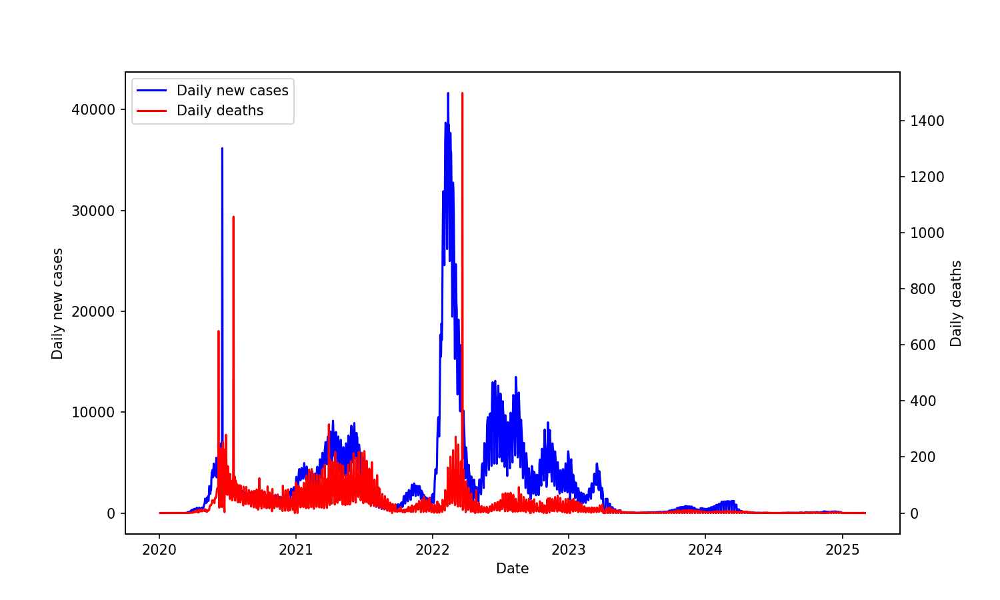
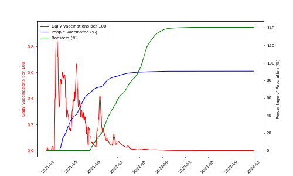
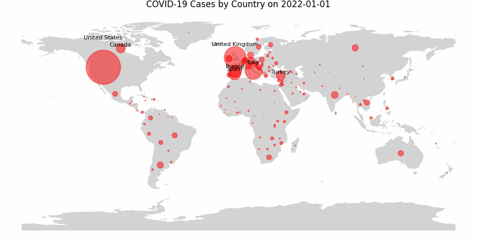
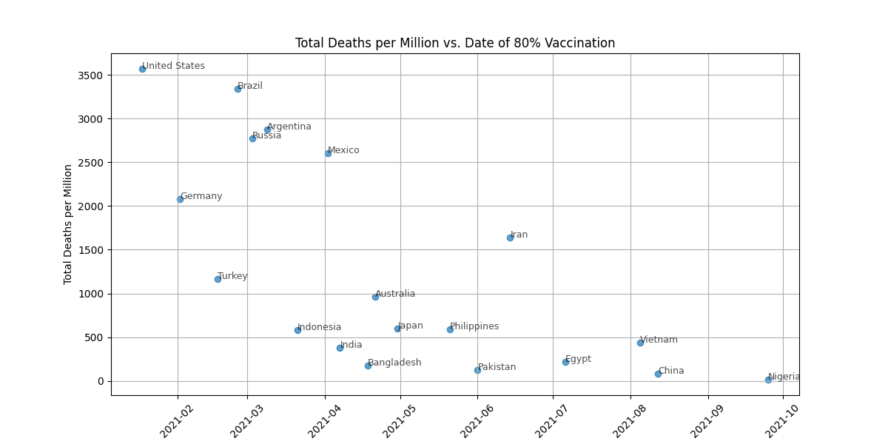
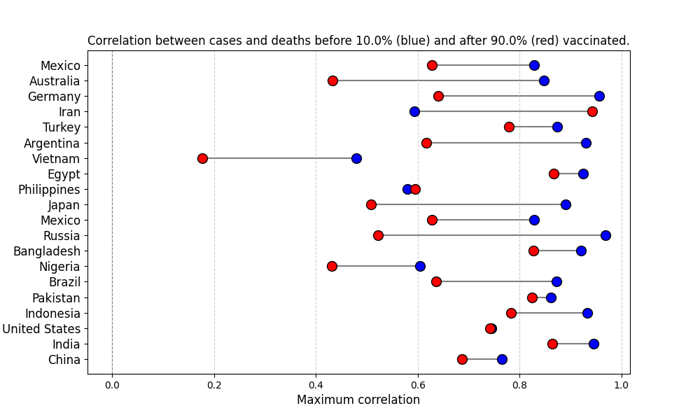

# COVID-19 Data Visualization and Analysis

This project provides a set of functions for visualizing and analyzing COVID-19 data, sourced from the *Our World in Data* COVID-19 databases. It includes various functions for data visualization and computing correlations, enabling users to recreate and analyze COVID-19 data for different date ranges and countries through the provided Jupyter notebook (`main`).

### Data Processing

The data required significant preprocessing before visualization and correlation analysis. For instance, many countries reported zero new COVID-19 cases throughout the week, only to post cumulative cases on Sundays or Mondays. To address this, I developed methods to extrapolate daily cases from these cumulative reports.

Another issue arises from governments' reporting practices. Often, after reclassification of cases or deaths, a sudden spike in reported deaths occurs when the additional deaths are posted on one day. This had to be handled carefully to ensure that the correlations were not significantly affected.

### Key Findings

Once these challenges were addressed, several interesting results emerged. Below, we present our findings and exhibit the code used in the analysis.

### 1. Chile's Daily Cases and Deaths Data

The first figure below shows the daily COVID-19 cases and deaths for Chile:

### 2. Vaccination Data for Chile

Next, we present the vaccination data for Chile:

 
 

### 3. COVID-19 Cases Visualization Across Countries

By extracting the data for each country over a range of dates, we can generate a GIF of the world map and show the new cases for each day. In this visualization, we plot a circle at the center of each country for each day, with the circle size proportional to the number of new cases. Countries with more than 40,000 new cases a day have their names displayed above the circle. The figure below shows this for January 2022:

 
 

### 4. Vaccination Rates and Deaths

The next figure demonstrates the date each country reached 80% vaccination and the corresponding total deaths for each country:

It's fascinating to observe that countries which vaccinated their populations quickly didn't necessarily have lower death rates. In fact, some early-vaccinated countries (e.g. the US) had high death rates. On the other hand, countries that vaccinated later often saw lower death rates, like China and Vietnam. This is likely due to the impact of lockdowns.

 
 

### 5. Correlation Between Cases and Deaths at Different Vaccination Rates

Finally, we analyze the correlation between cases and deaths at low (<10%) and high (>90%) vaccination rates. By identifying the date ranges when each country was in these two regimes, we compute the lagged correlations between cases and deaths. The lag is necessary as we expect some period of time between infection and death. 

For several countries, we calculate the maximum lagged correlation in the low and high vaccination regimes. The results are shown below:

This analysis demonstrates the effectiveness of vaccines. In nearly every country, higher vaccination rates lead to a weaker correlation between cases and deaths. In other words, the more vaccinated a country is, the less likely new cases will lead to deaths.
